- 今天学到了什么？

1. requestIdleCallback API，它可以让你在浏览器空闲时执行代码。将 react 组件渲染操作都放到 requestIdleCallback 中，可以提高页面的渲染效率。
2. 将组件树构造成链表结构，按序在 requestIdleCallback 中依次渲染执行，可以提高渲染效率。

- 遇到了哪些问题？

1. requestIdleCallback 刚开始理解起来有点抽象，不知道为什么 workLoop 里要继续调用 requestIdleCallback
2. 一次渲染任务，通过虚拟 DOM 树的关系转成链表切割成有序的单个任务，并交由 requestIdleCallback 执行，内部的 while 条件计算一开始看了有点懵逼。更多陷入了如果单个任务足够耗时，其实此时也是阻塞渲染的，但如果最小粒度的单个任务耗时，好像也无解。
3. requestIdleCallback 在 safari 有兼容问题，React 官方是怎么解决的？

- 怎么解决的？

1. 关于 requestIdleCallback，反复看了几遍官方文档的描述介绍，看了一下示例，似乎有点开窍，有了自己的理解
   1. requestIdleCallback 被调用时即创建了一个任务，这个任务有一个时间周期，到时间了你就应该释放，不要占用了，释放的意思就是不要有计算任务了，因为浏览器要去处理其他任务了
   2. 在 requestIdleCallback(workLoop)，在 workLoop 这个任务里可以调用 deadline.timeRemaining()方法查看这个任务的剩余时间，然后在剩余时间内执行任务，可以用`while(deadline.timeRemaining() > 1){}`在这个循环内执行任务
   3. 这个请求线程空闲时间的回调目的是高效利用单线程完成任务，而尽量不去阻塞高优先级的浏览器计算和渲染任务，那什么是高优先级的任务？浏览器怎么定义？
2. requestIdleCallback 兼容问题怎么解？

- 这节课对自己有什么帮助？

- 里面的哪些知识点是可以直接用到工作中的？

- 放上你写的代码链接(让你动手)
  https://github.com/janet-cat/mini-react
